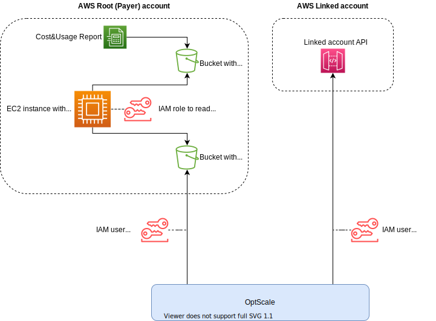

# Hystax OptScale Linked Report Extractor

This script:

1. Reads AWS usage reports from specified S3 bucket.
2. Removes entries not belonging to specified account IDs.
3. Saves processed reports to another S3 bucket.

## Installation

1. Make sure you have Python 3 and corresponding pip installed.
2. Enter script directory and run `pip3 install -r requirements.txt` to install required Python packages.

## Sample usage diagram

## Usage example

Take reports from `yv-report-bucket/reports/yv_report`, leave only entries belonging to `044478323321` and `876292135824` usage account IDs and save them to `yv-report-bucket/extracted-reports/yv_report` using the same credentials for source and target buckets.

```bash
python3 extract_linked_reports.py \
--source_bucket_name 'yv-report-bucket' \
--source_report_path_prefix 'reports' \
--source_report_name 'yv_report' \
--target_bucket_name 'yv-report-bucket' \
--target_report_path_prefix 'extracted-reports' \
--target_report_name 'yv_report' \
--usage_account_ids '044478323321,876292135824' \
--source_access_key_id 'YOUR_AWS_ACCESS_KEY_ID' \
--source_secret_access_key 'YOUR_AWS_SECRET_ACCESS_KEY' \
--target_access_key_id 'YOUR_AWS_ACCESS_KEY_ID' \
--target_secret_access_key 'YOUR_AWS_SECRET_ACCESS_KEY'
```

It is intended to be launched periodically with ~1h interval to process report updates.
